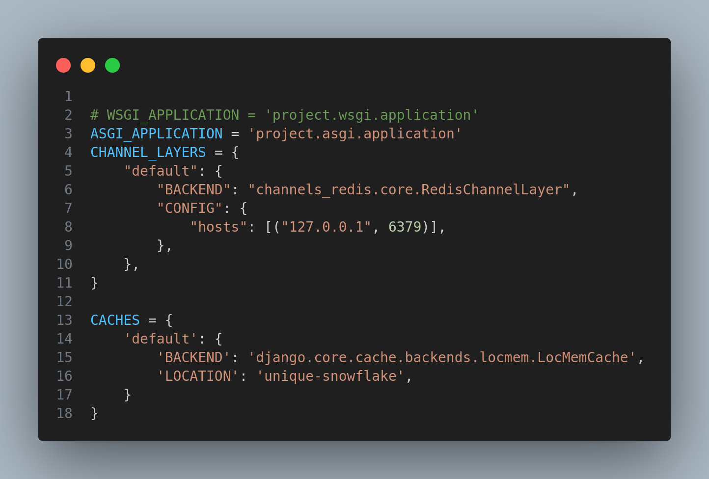
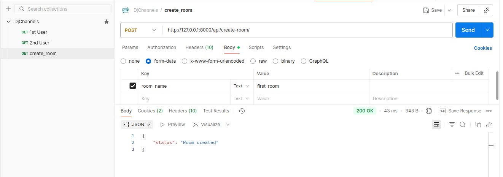
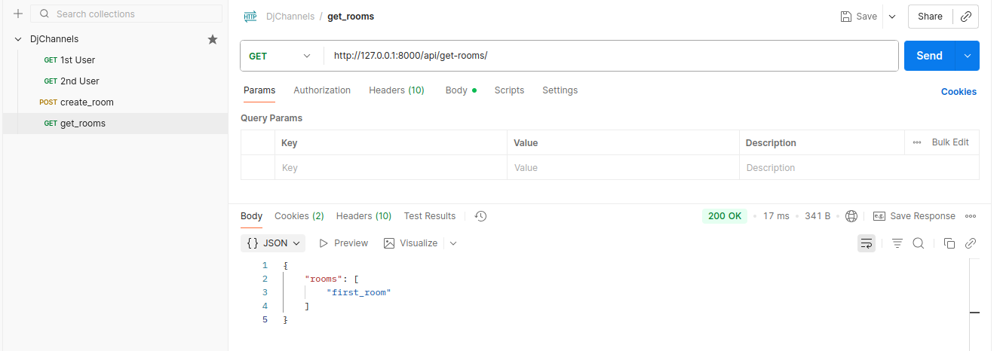
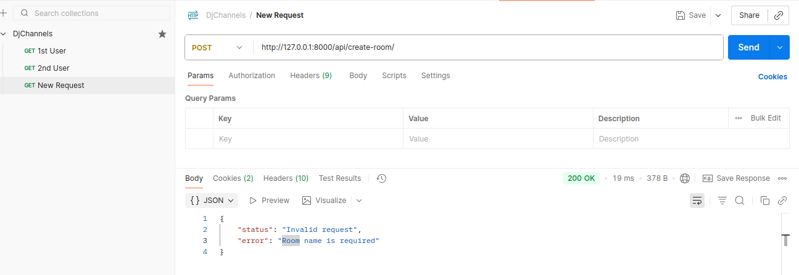
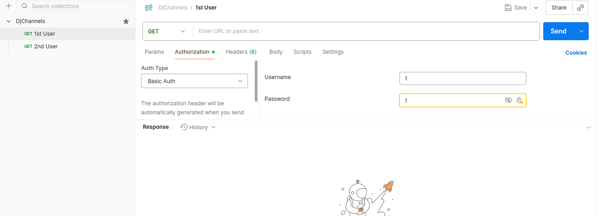
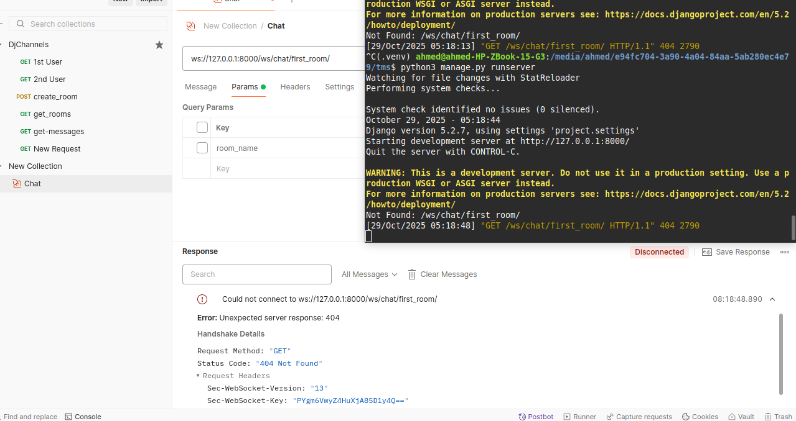

# DjChannels-WebSocket
 a simple real-time chat system using Django REST Framework and Django
Channels, while applying performance optimization techniques such as caching,
pagination, and indexing

```bash
mkdir tms
cd tms
python3 -m venv .venv
source .venv/bin/activate
pip install django djangorestframework channels_redis channels
django-admin startproject project .
```






 

